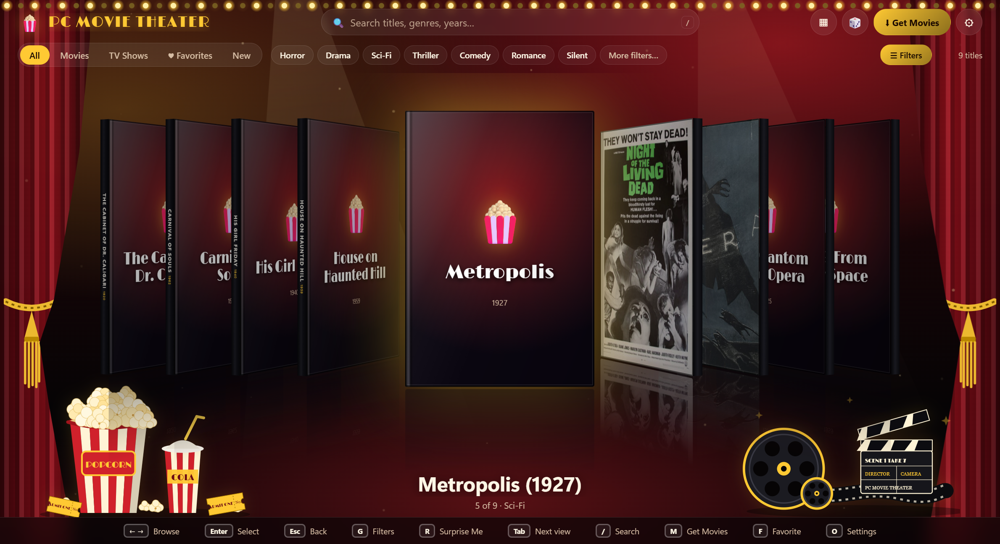
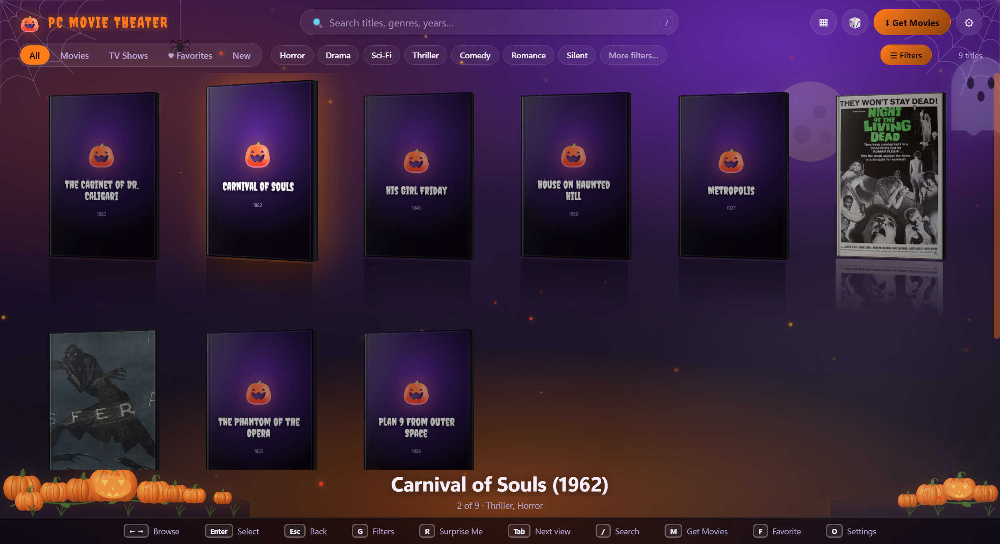
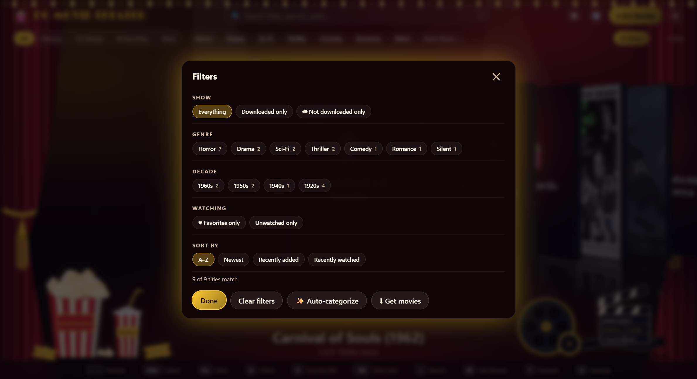

<p align="center"></p>

<h1 align="center">PC Movie Theater</h1>

<p align="center"><b>A free, open-source movie & TV library for Windows</b> — browse your collection as a shelf of 3D DVD boxes (like the old Xbox 360 dashboards), play anything with a YouTube-style player, and get seasonal themes that change with the calendar.</p>

<p align="center"></p>

## Features

- **3D cover-flow shelf** of DVD cases (or a **wall** layout), with reflections, spines and a hover-to-select wall. Mouse-edge scrolling, keyboard and **Xbox controller** support.
- **Plays everything** — MP4, MKV, AVI, MOV, WMV, WebM, HEVC, subtitles, multiple audio tracks (powered by [mpv](https://mpv.io)) with a clean **YouTube-style** control bar, resume where you left off, next-episode autoplay.
- **Movies *and* TV shows** — seasons and episodes are detected from folder/file names.
- **Auto covers & info** — missing cover? It asks, then fetches one (Wikipedia, iTunes, and optionally TMDB). Genres, years and descriptions fill in automatically and power the **genre / decade / rating filters**. Or pick your own image.
- **Smart titles** — recognised movies get their proper name (optionally rename the files too).
- **Favorites**, "Surprise me", Continue Watching, Recently Added, search, and a one-click switch to hide titles that aren't downloaded.
- **Get Movies** — search and download free films from the [Internet Archive](https://archive.org) right from the app, or add them to your shelf (faded) to download later. Delete a movie to free up space and it stays on the shelf, faded, ready to re-download.
- **Seasonal themes** — Halloween 🎃, Autumn 🍂, Winter ❄️ and the default **Movie Theater** 🍿, each with its own art, animation and sounds. They switch automatically by date, and you can add your own (a theme is just a folder with a JSON file, a CSS file and optional SVG decor).
- **Audio settings** — output device, night mode, stereo downmix, sync, and an optional **second output** (e.g. two Bluetooth headsets) kept in sync.
- **Fully remappable** keyboard and controller bindings, for both the shelf and the player.
- **Auto-update** — checks GitHub when you launch (if you're online) and *asks* before installing anything.

<p align="center">


</p>

## Install

1. Go to the **[Releases](https://github.com/quinkom/pc-movie-theater/releases/latest)** page and download **`PC-Movie-Theater-Setup-x.y.z.exe`**.
2. Run it. It installs just for you (no admin rights needed) and adds a desktop shortcut.
   - Windows may show a blue **"Windows protected your PC"** screen because the app isn't code-signed yet (code-signing certificates cost money and this is a free hobby project). Click **More info → Run anyway**. The full source is right here if you'd like to check it or build it yourself.
3. Launch **PC Movie Theater**. A quick first-run setup asks where your movies live and where downloads should be saved. You can add **several folders** (for example an external drive) — if a drive is unplugged its titles stay on the shelf, faded, until it's back. Change any of it later in **Settings → Library**.

Requires Windows 10/11 (64-bit).

### Organising your files

```
Movies\
  Night of the Living Dead (1968).mp4
  Some Movie\Some Movie.mkv
Shows\                       (anything under your library folder works)
  Show Name\Season 1\S01E01 - Pilot.mkv
  Show.Name.S02E05.mkv
```

Subtitles next to a video (or in a `Subs` folder) load automatically.

### Optional: TMDB key

Covers and info work out of the box (Wikipedia + iTunes). For even better matches add a free [TMDB API key](https://www.themoviedb.org/settings/api) under **Settings → Covers & info**.

## Controls

| | Keyboard | Xbox controller |
|---|---|---|
| Browse | ← → ↑ ↓ or WASD | D-pad / sticks |
| Open / select | Enter or Space | A |
| Back | Esc | B |
| Filters | G | X |
| Surprise me | R | Y |
| Next / previous view | Tab / Shift+Tab | RB / LB |
| Favorite | F | R3 |
| Get movies | M | — |
| Settings | O | Menu |

Everything is remappable in **Settings → Controls**. In the player: Space/K pause, ←/→ ±5 s, J/L ±10 s, ↑/↓ volume, C captions, A audio track, F fullscreen, `[` `]` audio sync, Esc leaves fullscreen and then asks to return to the shelf.

## Privacy

No accounts, no telemetry, no ads. The app only talks to: archive.org (search/download, when you use Get Movies), Wikipedia & iTunes (cover art / info lookups), TMDB (only if you add a key), and GitHub (update check). Your library list, covers and settings stay on your PC in `%APPDATA%\PC Movie Theater`.

## Build from source

```bash
git clone https://github.com/quinkom/pc-movie-theater.git
cd pc-movie-theater
npm install
npm run fetch-mpv     # downloads the mpv player into vendor/mpv
npm start             # run it
npm run dist          # build the installer into release/
```

Releases are built automatically by GitHub Actions when a `v*` tag is pushed (see `.github/workflows/release.yml`); installed copies find them through the auto-updater.

Making your own theme: copy `themes/classic` to `%APPDATA%\PC Movie Theater\themes\my-theme` (Settings → Look & feel → *Open my themes folder*) and edit `theme.json` / `theme.css` / `decor.html`.

## A note on downloads

The **Get Movies** screen is a search front-end for the Internet Archive, which hosts a huge amount of public-domain and freely shared film. Some uploads there may still be under copyright. **You are responsible for only downloading content you have the right to.** The built-in filter hides adult material and junk by default.

## Support the project

PC Movie Theater is free and always will be. If it's given you some good movie nights, an optional tip helps keep the updates coming:

- **Venmo:** [@quin-k](https://venmo.com/u/quin-k)
- **PayPal:** [donate](https://www.paypal.com/donate/?business=komquinton%40gmail.com&no_recurring=0&item_name=PC+Movie+Theater&currency_code=USD)

(In the app, click **♥ Support** in the bottom bar. The welcome window can be turned off in **Settings → About**.) Starring the repo and sharing it helps just as much. ⭐

## License & credits

PC Movie Theater is released under the **[MIT License](LICENSE)**. It bundles/uses open-source software — see **[THIRD_PARTY_NOTICES.md](THIRD_PARTY_NOTICES.md)** (mpv, ModernZ, Electron, fonts and more). This product uses the TMDB API but is not endorsed or certified by TMDB.

Contributions, bug reports and theme submissions are welcome — open an [issue](https://github.com/quinkom/pc-movie-theater/issues) or a pull request.
